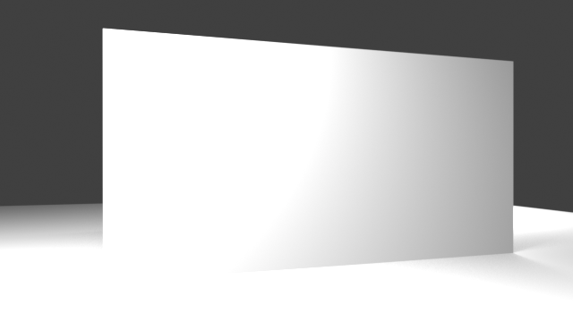

# DZ 3D 影像台

**拍之前，先试一遍镜头。**

这是李沅龙的个人影像工具项目：用简单三维模型摆好主体，试一下镜头从哪里开始、往哪里移动，再输出预览图、视频和可以继续修改的工程。

适合做产品展示、广告分镜，或者在生成 AI 视频前先把镜头想法讲清楚。

## 你可以拿它做什么

- **先试拍法**：比如“镜头慢慢靠近产品，再绕到侧面”，先看一遍画面再决定。
- **让 AI 按步骤帮忙**：把想拍的内容交给 AI，按整理好的操作说明拆出主体、位置、镜头方向和时长。
- **拿到可修改的文件**：除了预览图，还能输出 Blender 工程、三维模型和可选视频，方便继续调整或交给下一位同事。
- **找出画面为空的原因**：检查模型是否被隐藏、相机在哪里、画面尺寸是多少，辅助定位导入后看不到模型的问题。

## 一次使用长什么样

> 我有一个产品模型，想拍一段镜头慢慢靠近、再稍微绕到侧面的展示视频。

导入模型 → 设定时长和画面大小 → 生成首帧与中间帧 → 确认画面 → 输出工程或视频。



这里用简单几何模型演示拍法；实际使用时换成自己的产品模型即可。

## 仓库里有什么

Skill 就是一份给 AI 用的操作说明。这个项目把常用的拍摄准备和 Blender 操作整理成四份说明，并附上可以运行的脚本。

| 操作说明 | 帮你完成的事情 |
| --- | --- |
| `dz-shot-previs` | 把“我想怎么拍”变成具体的主体、位置、镜头移动和时长 |
| `dz-blender-camera-move` | 导入模型，生成靠近、轻微绕行的镜头，输出预览与工程 |
| `dz-blender-scene-review` | 检查模型、相机和画面设置，辅助排查空画面 |
| `dz-blender-python` | 在后台运行 Blender 任务，处理新建、导入、导出和渲染 |

## 运行示例

需要 Python 3.10+ 和本地 Blender。把 `--blender` 换成你的 Blender 程序路径。

```sh
python skills/dz-blender-camera-move/scripts/generate_camera_move.py --asset examples/neutral-subject.obj --out outputs/demo --blender /path/to/blender --frames 24 --width 640 --height 360
```

输出包括 `scene.blend`、`scene.glb`、`preview_001.png` 和 `preview_mid.png`。

需要视频时，先安装下面的可选依赖，再给上面的命令加上 `--render-video`。

```sh
python -m pip install imageio-ffmpeg
```

检查生成的工程：

```sh
blender --background outputs/demo/scene.blend --python skills/dz-blender-scene-review/scripts/inspect_scene.py
```

把需要的 `skills/dz-*` 文件夹复制到你的 AI 工具支持的 Skill 目录即可；也可以单独运行脚本。

## 当前版本

已经提供四份操作说明、镜头生成脚本、场景检查脚本和通用示例。实际测试已生成 Blender 工程、三维模型、预览图和 MP4 视频。

这是镜头试拍工具，画面主要用于判断拍法。浏览器编辑界面和物体碰撞模拟不包含在本次开源版本中；它也不会直接生成最终广告成片。

## 许可

[MIT](LICENSE)。运行依赖见 [项目与依赖](docs/provenance.md)。
